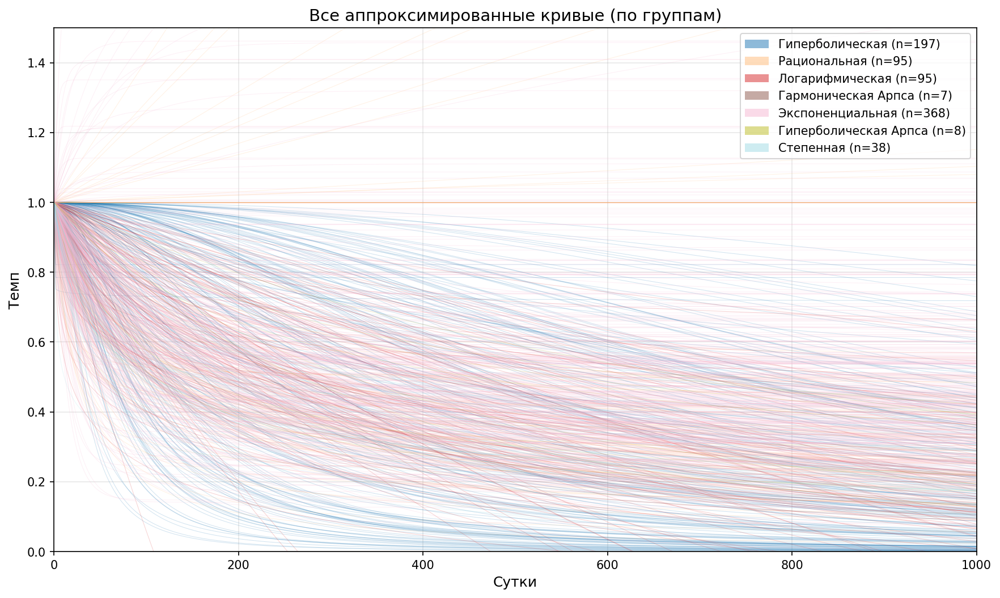
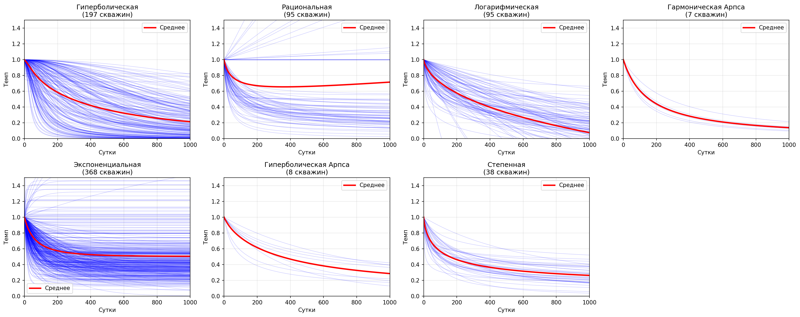
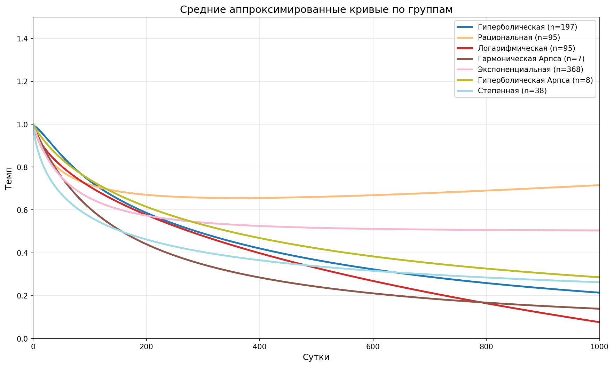
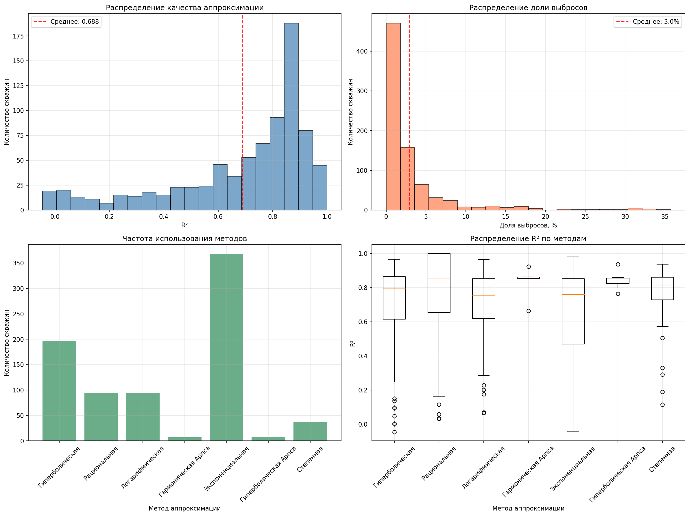

# 📈 Анализ и аппроксимация кривых падения добычи (Decline Curve Analysis)

[](https://www.python.org/)
[](https://opensource.org/licenses/MIT)

Инструмент для автоматизированного подбора моделей кривых падения добычи (DCA) по промысловым данным. Проект реализует итеративный алгоритм очистки данных от выбросов и сравнивает 7 различных математических моделей для каждой скважины, выбирая наилучшую.

<p align="center">
  
  <br>
  <em>Все проанализированные скважины, сгруппированные по типу подобранной модели.</em>
</p>

## 🌟 Ключевые особенности

*   **7 моделей аппроксимации**: Экспоненциальная, Логарифмическая, Степенная, Гиперболическая, Рациональная, Гармоническая Арпса, Гиперболическая Арпса.
*   **Интеллектуальная очистка данных**: Итеративный алгоритм исключения выбросов, повышающий качество подгонки.
*   **Учет физических ограничений**: Модели принудительно проходят через точку (0,1), что соответствует начальному дебиту.
*   **Масштабируемость**: Параллельная обработка скважин (`multiprocessing`) для ускорения анализа больших объемов данных.
*   **Детальная отчетность**: Генерация Excel-файлов с параметрами моделей, статистикой качества (`R²`) и информацией об удаленных выбросах.
*   **Визуализация**:
    *   Индивидуальные графики для каждой скважины (исходные данные, очищенные данные, выбросы, итоговая кривая).
    *   Групповые графики, показывающие средние кривые и разброс для каждого типа модели.
    *   Аналитические графики распределения качества аппроксимации.

## 📊 Примеры результатов

<table>
  <tr>
    <td><br><em>Групповые кривые: средняя линия для каждого метода.</em></td>
    <td><br><em>Сравнение средних кривых разных методов.</em></td>
  </tr>
  <tr>
    <td><br><em>Статистика по всем скважинам (R², выбросы, популярность методов).</em></td>
    <td><br><em>Пример обработки одной скважины.</em></td>
  </tr>
</table>

## ⚙️ Установка и запуск

1.  **Клонируйте репозиторий:**
    ```bash
    git clone https://github.com/your-username/decline-curve-analysis.git
    cd decline-curve-analysis
    ```

2.  **Установите зависимости:**
    Рекомендуется использовать виртуальное окружение.
    ```bash
    pip install -r requirements.txt
    ```

3.  **Подготовьте входные данные:**
    *   Создайте файл `Темпы.xlsx` в корневой папке проекта.
    *   **Формат файла:**
        *   **Ячейка A1:** Заголовок (например, "Скважина / Сутки").
        *   **Первая строка (B1, C1, ...):** Дни (0, 1, 2, ...).
        *   **Первый столбец (A2, A3, ...):** Названия скважин.
        *   **Остальные ячейки:** Нормированные значения дебита (темпы), где значение в день 0 = 1.
    *   Пример файла можно найти в папке [`sample_data/`](sample_data).

4.  **Запустите анализ:**
    ```bash
    python main.py
    ```

## 📁 Структура выходных данных

После выполнения скрипта в папке `results/run_YYYYMMDD_HHMMSS/` будут созданы:

*   **`Темпы_апроксимированные.xlsx`**: Интерполированные значения всех аппроксимированных кривых.
*   **`Аналитические результаты.xlsx`**: Детальная информация по каждой скважине и общая статистика.
*   **`time_statistics.xlsx`**: Время выполнения каждого этапа обработки.
*   **`well_plots/`**: Папка с индивидуальными графиками для каждой скважины (в формате PNG).
*   **`grouped_curves.png`**, **`all_groups_mean.png`**, **`all_curves_grouped.png`**, **`analytical_plots.png`**: Сводные графики.

## 🛠 Используемые технологии

*   **Python 3.8+**
*   **Pandas** & **NumPy**: Обработка и анализ данных.
*   **SciPy**: Подгонка кривых (`curve_fit`), интерполяция.
*   **Matplotlib**: Визуализация результатов.
*   **scikit-learn**: Метрика качества аппроксимации (`r2_score`).
*   **OpenPyXL**: Работа с Excel-файлами.

## 📄 Лицензия

Этот проект распространяется под лицензией MIT. Подробности см. в файле `LICENSE`.